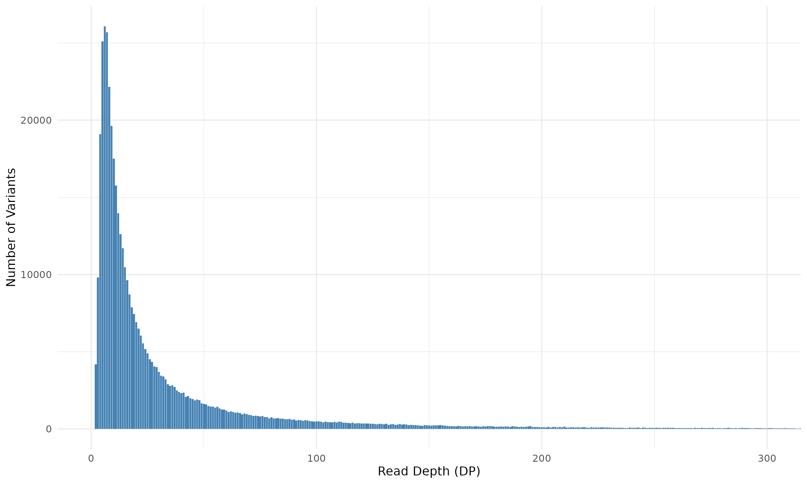
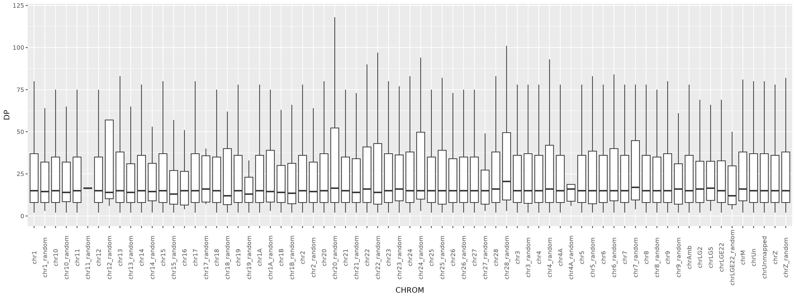

# Unix Course Final Assignment - Petr Kalina
Solution of task 2 for the final assignment in the course *UNIX and work with genomic data*

The following script in `workflow.sh` was used to process the input file.

```bash
#!/usr/bin/bash

INPUT="$1"


# count occurances of unique read depth values across whole genome
< $INPUT zcat | grep -v "^#" | cut -f8 | grep -Eo "DP=[^;]*" | sed 's/DP=//g' | sort | uniq -c | awk '{print $2 , $1}' > DP_counts


#DP VALUE DISTRIBUTIONS PER CHROMOSOME 

# extract chromosome label column
< $INPUT zcat | grep -v "^#" | cut -f1,8 | sort -k1,1 | cut -f1 > CHROM_temp

# extract DP values 
< $INPUT zcat | grep -v "^#" | cut -f1,8 | sort -k1,1 | cut -f2 | grep -Eo "DP=[^;]*" | sed 's/DP=//g' > DP_temp

# merge chromosome labels and corresponding DP values
paste CHROM_temp DP_temp > CHROM_DP

# remove temporary files
rm CHROM_temp
rm DP_temp

```

Contents of the resulting files were plotted using the following scipt in `data_analysis.R`.
```R
library(ggplot2)

CHROM_DP <- read.table("CHROM_DP", sep="\t", header=FALSE)
colnames(CHROM_DP) <- c("CHROM", "DP")


CHROM_DP_plot <- ggplot(CHROM_DP, aes(x=CHROM, y=DP)) +
    geom_boxplot(outlier.shape=NA) +
    coord_cartesian(ylim = c(0, 120)) +
    theme(axis.text.x = element_text(angle=90, vjust=0.5))

ggsave("CHROM_DP_plot.png", CHROM_DP_plot, width=16, height=6, dpi=300)

DP_counts <- read.table("DP_counts", header=FALSE)
colnames(DP_counts) <- c("DP", "Count")

DP_plot <- ggplot(DP_counts, aes(x=DP, y=Count)) +
  geom_bar(stat="identity", fill="steelblue") +
  coord_cartesian(xlim = c(0, 300)) +
  xlab("Read Depth (DP)") +
  ylab("Number of Variants") +
  theme_minimal()

ggsave("DP_distribution_plot.png", DP_plot, width=10, height=6, dpi=300)
```
## Instructions to use the scripts

```bash
#clone the repository
git clone https://github.com/ngs-course-prf-uk/ngs-course-final-assignment-25-26-kalinapetrcuni.git

#navigate into the repository
cd ngs-course-final-assignment-25-26-kalinapetrcuni

#execute the workflow script, passing the path to the input file as first argument
./workflow.sh /data-shared/vcf_examples/luscinia_vars.vcf.gz
```
Open RStudio (and set the working directory to the repository root (`ngs-course-final-assignment-25-26-kalinapetrcuni`))

Run the `data_analysis.R` script.

The resulting figures will be saved into the working directory.

## Figures

Distribution of read depth (DP) values across the whole genome


Distributions of read depth (DP) values per each chromosome

